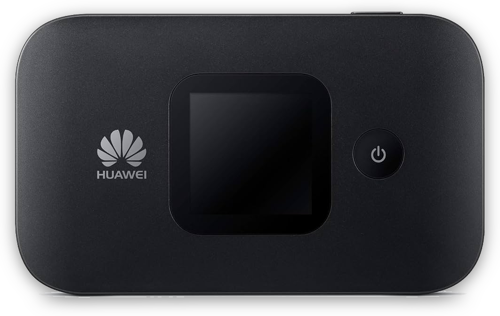
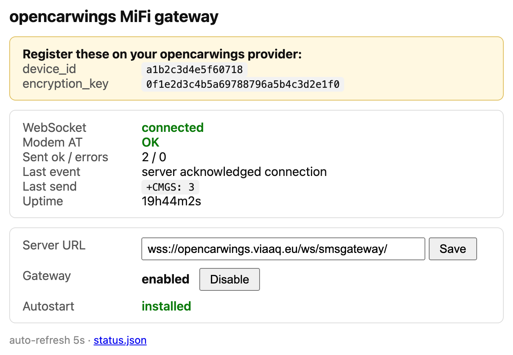

# opencarwings-mifi-gateway



A tiny SMS gateway for [opencarwings](https://github.com/developerfromjokela/opencarwings)
that runs on a Huawei Balong MiFi itself. One static binary, `ocwgw`. You install it from your
PC once and then it runs on the modem on its own, with nothing else needed to keep it going.

It opens the modem's second AT channel (`/dev/appvcom1`), connects to the opencarwings
websocket over the modem's own cellular data, decrypts the commands the server sends, and
sends the SMS (PDU or text) out through the modem. There is a small status and config web
page too.

This is a Go port of [developerfromjokela/opencarwings-sms](https://github.com/developerfromjokela/opencarwings-sms).
The protocol and the AT flow come from that project's Java client.

## Do you have the right device

You need a rooted Balong MiFi. It has been tested on a Huawei E5577s-321, firmware
`21.333.01.00.00` (a modded `_M_AT` build), ARMv7. Other Balong MiFis from that era are
probably fine, but untested.

The modem has to be rooted far enough that:

* `adb connect 192.168.8.1:5555` gives a root shell (`id` shows `uid=0`)
* `/dev/appvcom1` exists, the second AT channel and the one `ocwgw` opens. The notes
  below say why it does not touch `/dev/appvcom`
* the modem has working cellular data

Not there yet? See [docs/rooting-the-mifi.md](docs/rooting-the-mifi.md). To build the
binary yourself instead of using the prebuilt one, see [docs/building.md](docs/building.md).

## Install

From a machine that has adb and can reach the modem, fetch the latest release and install
it in one step:

```
scripts/install.sh
```

That downloads the latest `ocwgw-arm` (ARMv7) from the
[releases](https://github.com/albertbm/opencarwings-mifi-gateway/releases), pushes it to
`/online/ocwgw`, makes it executable, and adds it to the modem's boot script so it starts
on its own.

Built it yourself, or already have the binary? Point the script at it:

```
scripts/install.sh ocwgw-arm
```

By hand instead:

```
curl -fSLO https://github.com/albertbm/opencarwings-mifi-gateway/releases/latest/download/ocwgw-arm
adb push ocwgw-arm /online/ocwgw
adb shell chmod 755 /online/ocwgw
adb shell /online/ocwgw
```

## Register it

On first run `ocwgw` generates a random `device_id` and `encryption_key` and writes them to
`/online/ocw_gw.ids`, so they stay the same across restarts. Both are shown on its web page
and printed to its log. Register them with your opencarwings provider, whether that is the
public server or your own.

Until the `device_id` is registered the websocket keeps getting rejected. The page shows
that as "rejected, is device_id registered".

## The web page

`ocwgw` serves a page on port `8080`. From a device on the MiFi's wifi, or anything else that
can route to it:

```
http://192.168.8.1:8080/
```



It shows the values to register, the websocket state, whether the modem AT channel is
answering, a count of messages sent, and the last activity. Two things you can change
there:

* the Server URL, handy for pointing at your own server
* whether `ocwgw` is enabled

Both are saved and take effect right away. There is a `/status.json` endpoint too.

## Autostart

Two ways to make it start on boot:

* Open the web page and click Install next to Autostart. `ocwgw` runs as root, so it adds
  itself to the modem's boot script.
* Or run `scripts/install.sh`, which does the same from your host while it installs the
  binary.

Either way it adds a line to `/system/etc/autorun.sh` (a persistent partition) that starts
`ocwgw` a few seconds into boot. `ocwgw` waits for the AT device to appear, so a cold start
is fine. To undo it, delete that line from `autorun.sh`.

## How it talks to the server

Ported from the opencarwings-sms Java client:

1. Connect to `wss://<server>/ws/smsgateway/?device_id=<id>`.
2. The server sends binary websocket frames. Each is `[16 byte IV][AES-128-CBC ciphertext]`
   with PKCS5/7 padding, encrypted with the `encryption_key`.
3. The decrypted payload is JSON:
   * `{"type":"pdu","pdu":"<hex>","length":<tpduLength?>}`
   * `{"type":"sms","sms":"<text>","phone":"<number>"}`
   * `{"type":"connect"}`
4. For a PDU it runs `AT+CMGF=0`, then `AT+CMGS=<length>`, waits for the `>` prompt, writes
   the PDU followed by Ctrl-Z, and waits for `+CMGS:`. If `length` is missing it is
   computed as `totalBytes - (1 + smscLenByte)`.
5. For a text message it does the same in text mode (`AT+CMGF=1`).

## Implementation notes

The HiLink daemon polls the radio over `/dev/appvcom` to keep the cellular data connection
up. Open that channel from `ocwgw` too and HiLink goes blind, so `ocwgw` uses
`/dev/appvcom1` instead.

A few notes on how the binary is put together are in [docs/building.md](docs/building.md).

## Credit and licensing

This is a derivative of [developerfromjokela/opencarwings-sms](https://github.com/developerfromjokela/opencarwings-sms),
which has no license attached. Please treat the protocol and AT logic as belonging to that
project and sort out licensing with its author before reusing this anywhere.
