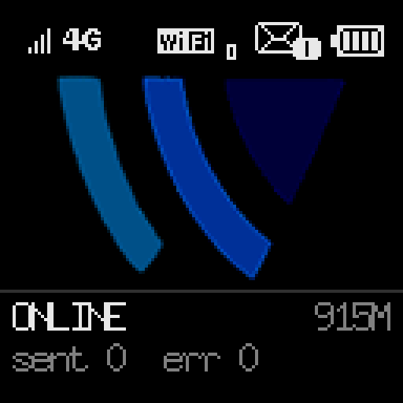

# opencarwings-mifi-gateway


A tiny SMS gateway for [opencarwings](https://github.com/developerfromjokela/opencarwings)
that runs on a Huawei Balong MiFi itself. One static binary, `ocwgw`. You install it from your
PC once and then it runs on the modem on its own, with nothing else needed to keep it going.

It opens the modem's second AT channel (`/dev/appvcom1`), connects to the opencarwings
websocket over the modem's own cellular data, decrypts the commands the server sends, and
sends the SMS (PDU or text) out through the modem. It draws its own screen on the modem's
colour front panel, and serves a status and config web page.

This is a Go port of [developerfromjokela/opencarwings-sms](https://github.com/developerfromjokela/opencarwings-sms).
The protocol and the AT flow come from that project's Java client.

## Do you have the right device

You need a rooted Balong MiFi. It has been tested on a Huawei E5577s-321, firmware
`21.333.01.00.00` (a modded `_M_AT` build), ARMv7. Other Balong MiFis from that era are
probably fine, but untested.

The modem has to be rooted far enough that:

* `adb connect 192.168.8.1:5555` gives a root shell (`id` shows `uid=0`)
* `/dev/appvcom1` exists, the second AT channel and the one `ocwgw` opens. The notes
  below say why it does not touch `/dev/appvcom`
* the modem has working cellular data

Not there yet? See [docs/rooting-the-mifi.md](docs/rooting-the-mifi.md). To build the
binary yourself instead of using the prebuilt one, see [docs/building.md](docs/building.md).

## Install

From a machine that has adb and can reach the modem, fetch the latest release and install
it in one step:

```
scripts/install.sh
```

That downloads the latest `ocwgw-arm` (ARMv7) from the
[releases](https://github.com/albertbm/opencarwings-mifi-gateway/releases), pushes it to
`/online/ocwgw`, makes it executable, and adds it to the modem's boot script so it starts
on its own. It also pushes `start-ocwgw.sh` to `/online/start-ocwgw.sh`, which is how you
start the gateway by hand without it dying when the adb session ends.

Built it yourself, or already have the binary? Point the script at it:

```
scripts/install.sh ocwgw-arm
```

By hand instead:

```
curl -fSLO https://github.com/albertbm/opencarwings-mifi-gateway/releases/latest/download/ocwgw-arm
adb push ocwgw-arm /online/ocwgw
adb shell chmod 755 /online/ocwgw
adb shell "trap '' HUP; /online/ocwgw < /dev/null > /online/ocwgw.log 2>&1 &"
```

That last line is not just `adb shell /online/ocwgw`. Two things would go wrong. adb
sends SIGHUP to the process group when the session ends, and this busybox has no
`setsid` and no `nohup`, so the gateway would die with the shell; ignoring HUP first
survives the exec. And a child still holding the pty's stdin hangs the adb session,
because this adbd has no `shell_v2` and the old transport waits for pty EOF, so stdin
goes to `/dev/null`. `scripts/start-ocwgw.sh` is the same thing as a file.

## Register it

On first run `ocwgw` generates a random `device_id` and `encryption_key` and writes them to
`/online/ocw_gw.ids`, so they stay the same across restarts. Both are shown on its web page
and printed to its log. Register them with your opencarwings provider, whether that is the
public server or your own.

Until the `device_id` is registered the websocket keeps getting rejected. The page shows
that as "rejected, is device_id registered".

## The web page

`ocwgw` serves a page on port `8080`. From a device on the MiFi's wifi, or anything else that
can route to it:

```
http://192.168.8.1:8080/
```


It shows a shot of the modem's panel, the values to register, the websocket state, whether
the modem AT channel is answering, the sent and error counts, the last event and last send,
uptime, and when the heartbeat last went out. Four things you can change there:

* the Server URL, handy for pointing at your own server
* the Heartbeat URL, and how often it fires
* whether `ocwgw` is enabled
* whether autostart is installed, if it is not already

The first three are saved and take effect right away. There is a `/status.json` endpoint
too.

## The screen

The MiFi's front panel becomes the gateway's standby screen. Wake it with either button and
this is what you get:



The panel turned out to be a colour one. Everything the stock UI draws is white on black,
and the firmware process driving it is called `oled`, so it reads as monochrome; painting
test bars straight at the framebuffer showed otherwise. It is 128x128 at 16 bits per pixel
behind `stlcd_tft_fb`, a TFT LCD with its own backlight, and it takes its pixels
big-endian. That is why the logo is drawn in its own blues. The text stays white, which is
easier to read at this size.

The top row is the modem's own status icons, drawn where the stock UI draws them: signal,
radio type, wifi with the number of clients on it, unread messages, battery. They are the
firmware's own bitmaps, read from its `icon.xml` at startup, not redrawn copies. Under the
logo is the gateway itself: `ONLINE`, `NO LINK`, `CONNECTING`, `STOPPED`, `NOT REGD` or
`NO MODEM`, the data this session has used, and the sent and error counts.

Each number comes from wherever the modem already keeps it: `AT+CSQ`, `AT^SYSINFOEX` and
`AT^DSFLOWQRY` on the AT channel the gateway already holds, the battery from
`/sys/class/power_supply`, the wifi clients from `/var/ap*_stainfo`, the unread count from
the firmware's web API.

The standby screen is the gateway's. The menu is still Huawei's:

* **Menu** hands the panel back to the stock UI. Its menu, SMS list, data pages and QR codes
  work the way they always did. The gateway takes the panel back 25 seconds after the last
  press.
* **Power**, while the screen is lit, asks whether to stop or start the gateway. Power
  answers yes, menu answers no. That is how you stop and start it with no phone and no PC.

The backlight comes on for 20 seconds per press, then goes out. Dark, the screen costs
nothing: no drawing, no AT queries. Lit and idle costs nothing either, because a frame that
would look the same as the one already on the panel is not drawn.

`/screen.png` serves a shot of the panel, drawn on request, and the status page shows it:

```
scripts/screenshot.sh 192.168.8.1:8080 panel.png
```

Start with `OCW_SCREEN=0` to leave the stock screen alone.

Two things to know. The gateway pauses the stock `oled` process while it holds the panel and
starts it again on the way out; `kill -9` is the one exit that skips that, and it leaves the
panel frozen on its last frame until the gateway runs again. And the icons come from the
file this firmware ships, so a modem that lays them out differently gets its own layout, or
plain bars and a battery box if the file is not there at all.

## Autostart

Two ways to make it start on boot:

* Open the web page and click Install next to Autostart. `ocwgw` runs as root, so it adds
  itself to the modem's boot script.
* Or run `scripts/install.sh`, which does the same from your host while it installs the
  binary.

Either way it adds the same line to `/system/etc/autorun.sh` (a persistent partition),
marked `# opencarwings gateway`, that starts `ocwgw` a few seconds into boot. `ocwgw`
waits for the AT device to appear, so a cold start is fine. To undo it, delete that line
from `autorun.sh`.

## Knowing when it stops

The server cannot tell you the gateway has gone away, so `ocwgw` pushes a short status line
out to a monitor on a timer and lets that shout at you when the pushes stop. Set a Heartbeat
URL on the web page, point it at an Uptime Kuma push monitor, and get a Telegram message when
it goes quiet. Off unless you set a URL. How it works and how to set it up is in
[docs/heartbeat.md](docs/heartbeat.md).

## How it talks to the server

Ported from the opencarwings-sms Java client:

1. Connect to `wss://<server>/ws/smsgateway/?device_id=<id>`.
2. The server sends binary websocket frames. Each is `[16 byte IV][AES-128-CBC ciphertext]`
   with PKCS5/7 padding, encrypted with the `encryption_key`.
3. The decrypted payload is JSON:
   * `{"type":"pdu","pdu":"<hex>","length":<tpduLength?>}`
   * `{"type":"sms","sms":"<text>","phone":"<number>"}`
   * `{"type":"connect"}`
4. For a PDU it runs `AT+CMGF=0`, then `AT+CMGS=<length>`, waits for the `>` prompt, writes
   the PDU followed by Ctrl-Z, and waits for `+CMGS:`. If `length` is missing it is
   computed as `totalBytes - (1 + smscLenByte)`.
5. For a text message it does the same in text mode (`AT+CMGF=1`).

## Implementation notes

The HiLink daemon polls the radio over `/dev/appvcom` to keep the cellular data connection
up. Open that channel from `ocwgw` too and HiLink goes blind, so `ocwgw` uses
`/dev/appvcom1` instead.

A few notes on how the binary is put together are in [docs/building.md](docs/building.md).

## Credit and licensing

This is a derivative of [developerfromjokela/opencarwings-sms](https://github.com/developerfromjokela/opencarwings-sms),
which has no license attached. Please treat the protocol and AT logic as belonging to that
project and sort out licensing with its author before reusing this anywhere.
